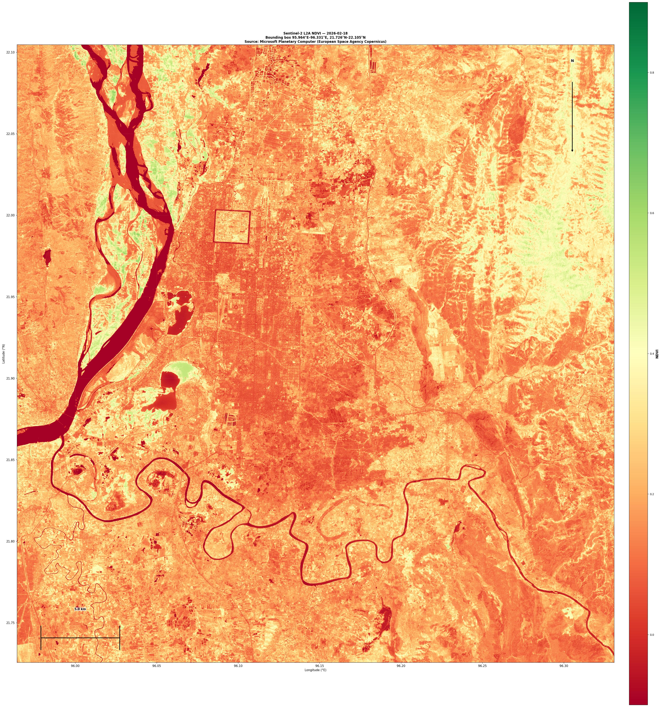

# Sentinel-2 NDVI — cloud-free imagery from Microsoft Planetary Computer

A small, reproducible pipeline that downloads the **most recent, cloud-free,
highest-quality Sentinel-2 Level-2A** imagery covering a bounding box of
interest (via the [Microsoft Planetary Computer](https://planetarycomputer.microsoft.com/)
STAC API), computes the **Normalized Difference Vegetation Index (NDVI)**, and
exports a **publication-ready JPEG**.

It was built for the bounding box `95.964203, 21.725697, 96.330872, 22.104726`
(central Myanmar), but works for any region. Because that box straddles the
96°E UTM-zone boundary, the tool automatically **mosaics multiple granules**
so the entire area of interest is covered.

---

## Features

- Queries the Planetary Computer STAC API for Sentinel-2 L2A (`sentinel-2-l2a`).
- **Auto-selects the best acquisition**: lowest mean cloud cover among all
  dates that *fully* cover the bounding box, with recency as a tie-breaker.
- **Mosaics granules across UTM zones** into one EPSG:4326 raster, so boxes
  that cross zone boundaries are handled transparently.
- Computes NDVI at native 10 m resolution from bands B04 (red) and B08 (NIR).
- Exports a georeferenced GeoTIFF **and** two JPEGs (annotated publication
  figure + plain colormap quick-look).

---

## Installation

Requires Python 3.10+.

```bash
python -m venv .venv
source .venv/bin/activate        # Windows: .venv\Scripts\activate
pip install -r requirements.txt
```

> Network access to `planetarycomputer.microsoft.com` is required. Signed
> item URLs are obtained automatically via the `planetary-computer` package.

---

## Usage

### 1. Download imagery and compute NDVI

```bash
python src/sentinel2_ndvi.py \
    --bbox 95.964203 21.725697 96.330872 22.104726 \
    --outdir output
```

Options:

| Flag       | Default        | Description                                                        |
|------------|----------------|--------------------------------------------------------------------|
| `--bbox`   | *(required)*   | `min_lon min_lat max_lon max_lat` in degrees                       |
| `--date`   | auto           | Force a specific acquisition `YYYY-MM-DD`                          |
| `--outdir` | `output`       | Output directory                                                   |
| `--res`    | `10.0`         | Output pixel size in metres                                        |
| `--start`  | `2019-01-01`   | Search start date                                                  |
| `--end`    | `2026-12-31`   | Search end date                                                    |

Without `--date`, the script prints the chosen date and its cloud cover and
writes `output/NDVI_<date>.tif`.

### 2. Export the publication-ready JPEG

```bash
python src/export_ndvi_jpeg.py --tif output/NDVI_2026-02-18.tif --outdir output
```

This produces:

- `output/NDVI_<date>_publication.jpg` — annotated map (colour bar, 5 km scale
  bar, north arrow, title, lat/lon grid).
- `output/NDVI_<date>_colormap.jpg` — plain native-resolution colormap raster.

---

## Example result

For the default Myanmar bounding box the auto-selector chose **2026-02-18**
(max cloud cover **0.0017%**, effectively cloud-free), mosaicking three
granules (`T47QKE`, `T46QHK`, `T46QGK`) that together give **100% coverage** at
10 m. NDVI ranged from −0.27 to 0.67 (mean 0.20), consistent with a mixed
vegetation / water / settlement landscape.



---

## Methodology

1. **Scene selection** — `pystac-client` searches `sentinel-2-l2a` for items
   intersecting the bounding box. Items are grouped by acquisition date; a date
   is accepted only if the *union* of its granules' footprints fully contains
   the box (with a small buffer for sub-pixel seams). Accepted dates are ranked
   by ascending mean cloud cover, with recency breaking ties.
2. **Mosaicking** — B04 and B08 are reprojected (bilinear) from each granule
   into a common EPSG:4326 grid at ~10 m. Later granules overwrite earlier ones
   in overlap areas (identical acquisition, so values agree).
3. **NDVI** — `NDVI = (B08 − B04) / (B08 + B04)`, using TOA/L2A surface
   reflectance (digital numbers divided by 10000), clipped to [−1, 1].
4. **Export** — the raster is colour-mapped (`RdYlGn`, low→high vegetation) and
   written both as a GeoTIFF and as JPEGs.

---

## Output files

| File                              | Description                                         |
|-----------------------------------|-----------------------------------------------------|
| `NDVI_<date>.tif`                 | Georeferenced NDVI (EPSG:4326, float32, 10 m)       |
| `NDVI_<date>_publication.jpg`     | Annotated publication figure                        |
| `NDVI_<date>_colormap.jpg`        | Plain colormap quick-look (native resolution)       |

Large `.tif` / `.npy` files are excluded from the repository via `.gitignore`;
the JPEG previews are committed. Re-run the scripts to regenerate all outputs.

---

## Data attribution

Sentinel-2 data © ESA / Copernicus, distributed by Microsoft Planetary
Computer. See [`NOTICE.md`](./NOTICE.md) for the required attribution text when
publishing derived products. Code is MIT-licensed (see [`LICENSE`](./LICENSE)).

---

## Repository layout

```
.
├── README.md
├── LICENSE
├── NOTICE.md
├── requirements.txt
├── .gitignore
├── src/
│   ├── sentinel2_ndvi.py      # STAC query, scene selection, mosaic, NDVI
│   └── export_ndvi_jpeg.py    # GeoTIFF -> publication JPEG
└── output/                    # generated products (JPEG previews committed)
```
